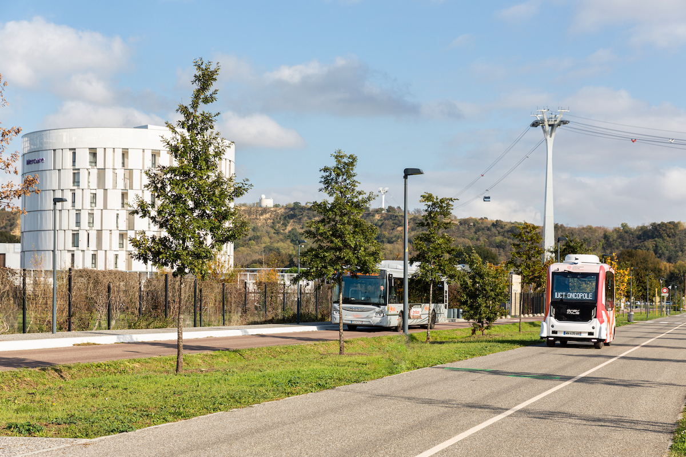

# Autonomous Vehicles

## Overview and Origin

* Easymile is a company that is using AI to shape the future of autonomous vehicles today. The company was founded in June of 2014 by Gilbert Ganaire and Philippe Ligeir. The co-founders both had a background in autonomous systems and saw a need for for autonomous vehicles and opened offices in France and Sigapore. In 2015 with stratigic partnerships launched their first autonomous vehicle the EZ10 which is a shuttle.

(EasyMile) (Wikipedia)

* EasyMile is backed by private equity firms from around the world.The latest series B raised 66 million in April of 2021 and with previous rounds of funding over 100 million total since 2014
(EasyMile) (Techcrunch)(Pitchbook)

## Business Activities

* Since the Jetsons first aired in 1962 people have fantasized about robots and self driving cars. In the past 10 years companies around the world have pushed the envelope on what is capable with automomous vehicles. Easymile is focused on reducing traffic congestion, safety and brining cost reductions via operation efficiencies through automomous vehicles. Currently they have 3 different solutions, EZ10, EZtow, and EZtug, the first a shuttle and the later for more commercial use in non-road scenarios.The company has more than 300 current deployments around the globe and has many world first achievements. 
(EasyMile)​​ (Future Transport-News)​

* EasyMile being in the autonomous vehicle market has a wide range of customers. With the EZ10 the target market is public or private transit companies who shuddle people around. For EZtow and EZtug, the autonomous vehicles are designed to pull or move objects around within a confined area making them more suitable for airports or other industrial customers. The market is too large to quantify given autonomous vehicles can be used by everyone in the transportaion industry. Just one sector of customers in public transportation is alone 253 billion dollars
(EasyMile)​​ (Future Transport-News)​

* EasyMile stands out from the competion based on several factors. EasyMile has several patents, strong partnerships and over 300 deployments with a great tract record. Known as a company that invents the rules they have several Worlds first. The offered solution have level 4 autonomy and have an ISO 9001:2015 Certification which sets them apart from most of their competition
(Cruchbase) (EasyMile)

* EasyMile uses many technologies with the building and deployment of autonomous solutions offered. My research was geared towards the AI side of these technologies which most of the information I had to infer what technologies are being utilized as the data sources used for this had almost no details for me to review. For perception multiple sensors are used and AI algorithms can process the data and create an understanding of its surrounds, the models can even classify objects into catagoris to include people, other vehicles, or obsticles. The mapping technology Simultaneous Localization and Mapping (SLAM) uses AI to continually update and improve maps of its environment in near real time. The use of (SLAM) with AI, is what got me interested in this company for this case study. 

   >> "EasyMiles's powerful localization algorithm calculates the vehicle’s position with centimeter-level accuracy in real-time by fusing data obtained from the sensor set, comprised of:

    * Lidars (Laser Detection And Ranging),
    * Differential GPS (global positioning system) and RTK (real-time kinematic positioning),
    * Inertial Measurement Unit (IMU),
    * Odometry.

    >> EasyMile’s satellite navigation technology is a multi-GNSS system that processes GLONASS as well as the original GPS. The system’s precision is enhanced by real-time Kinematic (RTK) processing. The GNSS position is also used in conjunction with information from the 3G or 4G grid, with 5G testing underway" (EasyMile).

    AI is also used in Human-Machine Interface (HMI) although not explicitly named in anything I found online, my assumption is this is a use of Natural language processing as discussed in our class. The company uses AI for other processing like decision making where the automous vehicle can predict the behaviour of other objects such as pedestrians and vehicles, or optimizing routes based on many external imputs such as traffic conditions, road closures, ect. The main two areas AI is used is in control systems and safety in which the AI systems can control driving based on input from multiple sensors, and also monitor for system errors to either corse correct or safely stop to mitigate risks.
    (EasyMile)

## Landscape

* EasyMile produces autonomous vehicles with a focus on targeted solutions for industrial purposes and the mass transportation markets with its autonomous shuttles.
(EasyMile)

* With a mainstream adoption of electric cars, specifically Tesla has opened the flood gates for funding of autonomous vehicles. Within the past 10 years sensor technology has greatly imporved allowing more autonomy of self driving machines. Currently, AI is paving the way and the increased processing is forcing a revolution in hardware design with chipsets that can handle this increased demand in computing.AI is allowing for better mapping, real time decision making, safer and  more robust solutions along with increased efefficiencies.

* There are a lot of new comers to this space, but the major competitors for EasyMile are:Navya, TTTech Auto, May Mobility, Torc Robotics, Waymo, Gaussin-Mancnica-Mobility and Tesla
(Google search returned many resutls)

## Results

* As a relatively new company in an emerging market EasyMile has made a significant impact on the market. Not only have they deployed autonomous vehicles at sites in 30 countries, the company maintains and meets the highest safety standards being the first company in the world to receive an ISO 9001:2015 Certification. They are continuing to improve client satsfaction and deploy level 4 autonomous vehicles worldwide. 
(EasyMile)

* In the autonomous vehicle industry the core metrics are safety, operational efficiencies, customer satisfaction, economic impact and perfomance metrics.
(EasyMile) (Investopedia)

* EasyMile is leading its most direct competitor Navya in every measurable metric.It is a much more difficult task to compare its success with other autonomous manufactures  such as Waymo and Tesla as these companies have very advanced vehicles with millions of miles diven where as easymile has around 620000K miles of short commutes. The other metrics would in general favor Easymile although on scales considerably smaller than both Tesla and Waymo. It should be noted that Easymile is 100% autonomous and currently being utilized in several deployments world wide. It is noteworthy that easymiles automomous vehicles tend to have less complex tasks as they are not personal vehicles and often run in areas with less obstructions, which may lead to significantly less safety issues compared to others in the space. Utilization rates are high as many deployments run in 24/7 industries such as airports. Initial costs are high, but monthly expenses are down mostly due to the cost savings of labor, which I disagree with as the models I have seen are re-allocating the labor to a different catagory and therefore may not really decrease labor costs, but effecincies are clearly savings cost but not quantified anywhere that I saw. I think it is early in the adoption stages and as the technology matures the cost will be more affordable and will have a real impact on cost savings.
(EasyMile)

## Recommendations

* If you were to advise the company, what products or services would you suggest they offer: I would suggest they develop the technology to be deployable with more manufactures and branch out from the current 3 products they have and make it a technology as a service company as well.

* Why do you think that offering this product or service would benefit the company? Currently they are focused on creating full soultions using their technology working with a few manufacturers instead of leveraging the technology to work with all manufactures. 

* What technologies would this additional product or service utilize? I think the possiblities are limitless and could be used with almost anything that is self propelled and mobile.

* Why are these technologies appropriate for your solution? Currenlty most automomous solutions are at a very low level and require much human oversight, the technologies developed and utilized by Easymile could greatly enhance current autonomous robots and pave the way for new and better innovations that will revolutionize the way machines can work for us.

## References

* EasyMile. (n.d.). EasyMile. Retrieved July 14, 2024, from https://easymile.com/

* Wikipedia contributors. (n.d.). EasyMile EZ10. Wikipedia, The Free Encyclopedia. Retrieved July 14, 2024, from https://en.wikipedia.org/wiki/EasyMile_EZ10

* EasyMile. (n.d.). EZ10 passenger shuttle. EasyMile. Retrieved July 14, 2024, from https://easymile.com/vehicle-solutions/ez10-passenger-shuttle

* Fouéré, C. (2023, April 4). EasyMile raises €55 million Series B led by Searchlight Capital Partners. EasyMile. Retrieved July 14, 2024, from https://easymile.com/insights/easymile-raises-55-million-series-b-led-searchlight-capital-partners

* PitchBook. (n.d.). EasyMile. PitchBook. Retrieved July 14, 2024, from https://pitchbook.com/profiles/company/169860-07#research

* Lomas, N. (2021, April 28). EasyMile raises €55M for its autonomous shuttles and tow tractors. TechCrunch. Retrieved July 14, 2024, from https://techcrunch.com/2021/04/28/

* Future Transport-News. (2024, July 8). Autonomous Towing Demo at Toyota Material Handling Systems during MODEX 2024. EasyMile. Retrieved July 14, 2024, from https://futuretransport-news.com/autonomous-towing-demo-at-toyota-material-handling-systems-during-modex-2024/

* EasyMile. (2024, March 1). Company information and deployments. EasyMile. Retrieved July 14, 2024, from https://easymile.com/company-information-and-deployments

* Crunchbase. (n.d.). EasyMile - Tech stack, apps, patents & trademarks. Retrieved July 14, 2024, from https://www.crunchbase.com/organization/easymile/technology

* Sharma, R. (2021, November 18). Tesla's success depends on autonomous driving tech. Investopedia. Retrieved July 14, 2024, from https://www.investopedia.com/tesla-success-depends-on-autonomous-driving-tech-5210135

